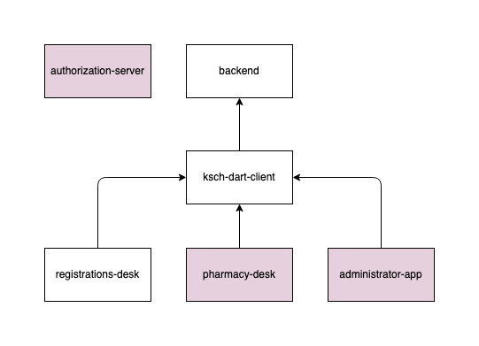

# Building Block View

The [backend](https://github.com/ksch-workflows/backend) provides a REST API which abstracts database access and
business process validations for the client applications.

All the client applications are [Flutter](https://flutter.dev) apps.
They are using the [ksch-dart-client](https://github.com/ksch-workflows/ksch-dart-client) library for accessing the REST API
of the backend.

The [registration-desk](https://github.com/ksch-workflows/registration-desk) is a Flutter Web app to be used at the
registration desk of the KSCH.

Later on there should also be a Flutter Web app for the pharmacy desk.

Further, there should be a Flutter Android app for the hospital administrator.

For the first experiments with the system, all the REST requests will be unauthenticated.
When the system goes live, the requests should be authenticated using an
API token aquired via an OAuth 2.1 authorization server.

## References

**arc42**

- [https://docs.arc42.org/section-5/](https://docs.arc42.org/section-5/)
- [Building Block View | dokchess.de/en](https://www.dokchess.de/en/05_buildingblockview/)

