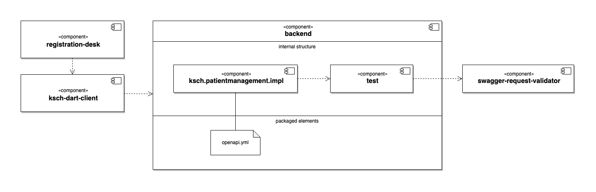

# OpenAPI

OpenAPI is a standard for the specification of [HTTP APIs](https://www.educative.io/blog/what-are-rest-apis).
It is designed to be readable both by humans and by machines.
So, it is possible to declare OpenAPI Specifications (OAS) in a plain text file that can then be used by computer projects for validation and code generation.

---

**Table of contents**

- [Overview](#overview)
- [Design process](#design-process)
- [Documentation](#documentation)
- [References](#references)

---

## Overview

The [backend](https://github.com/ksch-workflows/backend) component offers a [REST API](https://www.restapitutorial.com/lessons/whatisrest.html) for the frontend components like for example [registration-desk](https://github.com/ksch-workflows/registration-desk).
Inside the [backend](https://github.com/ksch-workflows/backend) there are for example the sub-components `ksch.patientmanagement.impl` and `test`. The `ksch.patientmanagement.iml` components defines the REST handlers which will process the requests from the API clients.

The `test` component defines various utilities which can be used for the internal tests of the other components.
It has a dependency on Atlassian's open source project [swagger-request-validator](https://bitbucket.org/atlassian/swagger-request-validator) and defines a utitlity class for its initialisation.
The internal tests of `ksch.patientmanagement.impl` components leverage the functionality of [swagger-request-validator](https://bitbucket.org/atlassian/swagger-request-validator) to verifiy that the test requests and responses match with the API structure defined in the OAS.

The [registration-desk](https://github.com/ksch-workflows/registration-desk) uses the Dart library [ksch-dart-client](https://github.com/ksch-workflows/ksch-dart-client) for accessing the REST API. Currently the code of that component is manually created. Later on, the Dart code in the [ksch-dart-client](https://github.com/ksch-workflows/ksch-dart-client) component could be generated from the `openapi.yml` file.

The structures described above are visualised with the following [UML Component Diagram](https://www.visual-paradigm.com/VPGallery/diagrams/Component.html):

## API design process

The idea of the API design process is to create the "spec first" and afterwards the implementation.
So, if the maintainer of frontend clients need a change in the [backend](https://github.com/ksch-workflows/backend) API, they can make a proposal for a change in the `openapi.yml`.
Once there is an agreement on the change to the OSA, the [backend](https://github.com/ksch-workflows/backend) maintainer and the frontend client mainainers can work in parallel on the new feature.

**Also see**

- [Using spec-first API development for speed and sanity | atlassian.com](https://www.atlassian.com/blog/technology/spec-first-api-development)
- [Episode 542: Brendan Callum on Contract-Driven APIs | se-radio.net](https://www.se-radio.net/2022/12/episode-542-brendan-callum-on-contract-driven-apis)

## Documentation

The [backend](https://github.com/ksch-workflows/backend)'s [API documentation](https://api.experimental-software.com) is generated from the OAS with the free plan of the SaaS service [bump.sh](https://bump.sh/).

## References

- [OpenAPI Specification 3.0](https://swagger.io/specification/v3/) 
- [Spring: Adding OpenAPI validation to MockMVC tests | dev.to](https://dev.to/janux_de/spring-adding-openapi-validation-to-mockmvc-tests-2p21)
